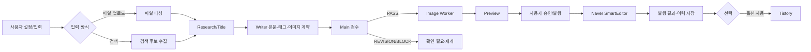

# 네이버 블로그 자동화 프로그램 — 한 장 요약

## 목적

Electron 기반 Windows 데스크톱 프로그램으로 원본 파일 또는 웹 검색 자료를 바탕으로 네이버 블로그 초안을 만들고, 사용자의 승인에 따라 네이버 블로그에 입력·발행합니다. 선택 사항으로 네이버 발행 후 티스토리 발행을 이어서 수행할 수 있습니다.

## 전체 흐름



## 주요 모듈

| 영역 | 실제 담당 파일 |
|---|---|
| Electron main/IPC | `src/main.js`, `src/preload.js` |
| 화면 | `src/renderer/index.html`, `src/renderer/app.js`, `src/renderer/styles.css` |
| Codex 에이전트 | `src/lib/codexRunner.js` |
| 검색 | `src/lib/search.js` |
| 원본 파일 | `src/lib/fileParser.js` |
| 네이버 발행 | `src/lib/naverPublisher.js` |
| 이력 | `src/lib/history.js` |
| 복구 | `src/lib/recoveryPlaybook.js`, `src/main.js` |
| 회원마당 일일 흐름 | `src/lib/memberBoardCrawler.js`, `src/lib/memberBoardPublisher.js`, `src/lib/dailyWorkflow.js` |
| 스케줄러 | `src/lib/windowsScheduler.js`, `src/lib/register-scheduler.ps1` |

## 현재 구현의 핵심 경계

- 일반 작업의 검색 모드와 파일 업로드 모드는 분리됩니다.
- 파일 업로드 모드는 업로드된 자료만 근거로 사용하며 웹 검색을 하지 않습니다.
- 회원마당 일일 흐름은 회원마당을 수집해 9개 슬롯으로 분류하는 별도 흐름입니다.
- 일반 네이버 발행과 작업 이력 발행은 네이버 전용입니다. 온새카 등록은 별도 회원마당 흐름입니다.
- 네이버 비밀번호는 저장하거나 자동 입력하지 않고, 전용 Chrome 프로필의 수동 로그인 세션을 재사용합니다.
- `REVISION`, `BLOCK`, 근거 부족, 카테고리 불일치 등은 잘못된 발행을 막기 위해 발행하지 않고 확인 필요로 보존합니다.

## 주요 저장 위치

패키지 실행 시 기본 런타임은 `%APPDATA%\blogauto-naver-tistory\runtime`입니다.

```text
runtime/
├─ user-settings.json              # 일반 설정
├─ account-categories.json         # 계정·카테고리
├─ blog_history.jsonl              # 작업 이력
├─ jobs/job_<id>/                  # 작업별 입력·체크포인트·초안
├─ browser-profiles/               # 로그인 세션 프로필
├─ member-board-daily-plan.json    # 일일 계획
└─ scheduler-status.json           # 스케줄러 상태
```

## 확인 상태

| 항목 | 상태 |
|---|---|
| 소스 기반 역분석 | PASS |
| 실제 파일·함수 연결 | PASS |
| 설치파일 생성 재현성 | PARTIAL — portable 빌드 스크립트 확인, 설치·실행 라이브 검증 필요 |
| GitHub 공개 | 보류 — 공개/비공개와 push 승인이 필요 |
| 현재 사용자 런타임·로그인 세션 | 보존, 문서에 비밀값 미기록 |
