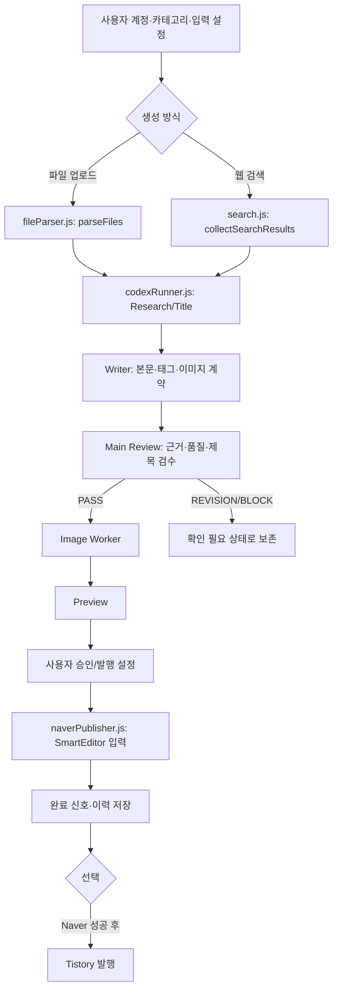
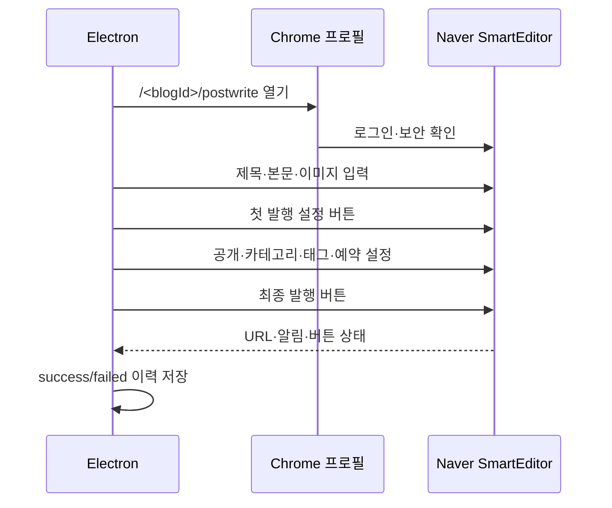

# 네이버 블로그 자동화 — 프로그램 전체 역분석·FLOW

## 1. 프로그램 목적

Electron 기반 Windows 데스크톱 프로그램입니다. 사용자가 입력한 주제·검색자료·원본 파일을 바탕으로 Research/Title, Writer, Main Review, Image Worker를 순서대로 실행하고 Preview와 승인 과정을 거쳐 네이버 블로그에 글을 입력·발행합니다.

Tistory 후속 발행과 온새카 회원마당 수집·등록은 별도 선택 흐름입니다.

## 2. 전체 처리 흐름



## 3. 실제 모듈 구조

```text
src/main.js                 # Electron main process, IPC, 작업 오케스트레이션
src/preload.js              # renderer에 노출하는 window.blogAuto API
src/renderer/index.html     # UI 구조
src/renderer/app.js         # UI 상태·버튼·목록·이벤트
src/renderer/styles.css     # UI 스타일
src/lib/codexRunner.js      # 에이전트 프롬프트·실행·결과 정규화
src/lib/search.js           # Naver/Google 검색 후보와 근거 품질
src/lib/fileParser.js       # TXT/MD/PDF/DOCX/XLSX/XLS/CSV/PPTX
src/lib/naverPublisher.js   # 로그인 세션·SmartEditor·발행
src/lib/tistoryPublisher.js # Tistory 발행
src/lib/history.js          # blog_history.jsonl 읽기·쓰기·상태 변경
src/lib/imageAssets.js      # 이미지·초안 자산 정규화
src/lib/dailyWorkflow.js    # 회원마당 9개 슬롯 계획
src/lib/memberBoardCrawler.js
src/lib/memberBoardPublisher.js
src/lib/recoveryPlaybook.js # 오류 해결책과 복구 시도 기록
src/lib/windowsScheduler.js # Windows 작업 등록·해제
```

## 4. 일반 작업 단계

1. `renderer/app.js`가 화면 입력을 수집합니다.
2. `main.js`의 `startJob(form)`이 계정·설정·작업 폴더를 준비합니다.
3. 파일 모드에서는 `parseFiles()`가 원본을 공통 자료 구조로 바꿉니다.
4. 검색 모드에서는 `collectSearchResults()`가 검색 후보, 본문, 도메인, 최신성, 공식성을 평가합니다.
5. `runCodexGeneration()`이 Research/Title → Writer → Main Review → Image 순으로 실행합니다.
6. 결과는 `agent-result.json`과 Preview 이벤트로 저장·표시됩니다.
7. 기본 생성 상태는 `DRY_RUN`입니다. 발행 설정을 켜고 검수가 통과해야 네이버 발행으로 넘어갑니다.

## 5. 파일 업로드 처리

지원 형식은 `.txt`, `.md`, `.pdf`, `.docx`, `.xlsx`, `.xls`, `.csv`, `.pptx`입니다. PDF에서 읽을 텍스트가 없으면 스캔·이미지형 PDF일 가능성으로 `PDF_TEXT_EMPTY` 오류가 발생합니다. 파일 모드는 업로드 자료를 근거로 사용하며 현재 README상 웹 검색을 실행하지 않습니다.

## 6. 네이버 발행

`naverPublisher.js`는 계정별 persistent Chrome 프로필을 사용합니다. 네이버 비밀번호를 저장하거나 자동 입력하지 않고, 사용자가 Chrome에서 로그인·보안 확인을 완료하면 세션을 재사용합니다.

발행 단계는 다음과 같습니다.



태그 영역은 Naver 화면 변형에 따라 없을 수 있는 선택 항목입니다. 카테고리를 찾지 못하면 잘못된 카테고리 발행을 막기 위해 중단합니다.

## 7. 회원마당 일일 흐름

`memberBoardCrawler.js`가 회원마당을 수집하고 `dailyWorkflow.js`가 정부·공공기관, 법원·법률, 보험업계, 정비업계, 완성차·기업, 연구·전문가, 언론기사, 소비자·안전, 일반 시사의 9개 슬롯으로 계획을 만듭니다.

```text
회원마당 수집
→ 9개 슬롯 계획
→ 초안 생성
→ 사용자 항목 승인
→ 승인 항목 네이버 발행
```

현재 회원마당 흐름은 회원마당 원문을 수집·분류하는 흐름입니다. 9개 카테고리 각각을 독립적으로 웹 검색하는 기획과는 다르므로 두 기능을 같은 것으로 설명하지 않습니다.

## 8. 작업 이력·복구


작업별 파일은 다음 위치에 저장됩니다.

```text
runtime/jobs/job_<id>/job-input.json
runtime/jobs/job_<id>/job-checkpoint.json
runtime/jobs/job_<id>/agent-result.json
runtime/jobs/job_<id>/image-worker-progress-*.json
```

체크포인트 단계는 `research`, `writer`, `main_review`, `image`입니다. 오류 해결 프롬프트를 입력한 뒤 `resumeJob`이 저장된 완료 결과를 재사용하면서 실패 단계부터 재개하는 것이 목표입니다. 로그에서 앞 단계가 반복되면 실제 runtime과 체크포인트 해석을 확인해야 합니다.

## 9. 핵심 오류 경계

| 오류 | 실제 확인 범위 | 대응 |
|---|---|---|
| 검색 후보 없음 | 공식성·최신성 요구 대비 usable 후보 부족 | 보강 검색 후 확인 필요 보존 |
| 근거 부족 | 원문 밖 법안번호·날짜·수치 또는 제목-본문 불일치 | 임의 보완 금지, `REVISION/BLOCK` |
| Image Worker timeout | Codex 실행환경 또는 제한시간 초과 | 이미지별 progress와 재개 사용 |
| `agent-result.json` 없음 | 본문 생성 전 단계에서 중단 | 원본이 있으면 재생성, 없으면 발행 불가 |
| 카테고리 없음 | 실제 Naver 카테고리와 저장값 불일치 | 정확한 카테고리만 사용 |
| 발행 완료 확인 실패 | Naver 팝업·설정창·완료 신호 변형 | 브라우저 유지 후 진단 |

