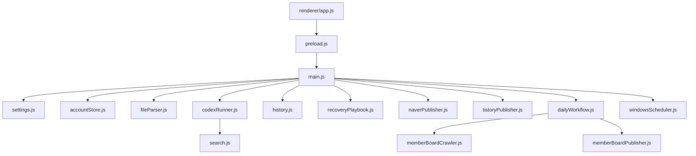

# 프로그램 전체 구조

## 실제 트리

```text
blogauto-naver/
├─ package.json                 # Electron 실행·빌드·의존성
├─ package-lock.json            # 의존성 잠금
├─ README.md                    # 사용자 안내와 현재 동작 경계
├─ .gitignore                   # 런타임·비밀정보·빌드 제외
├─ src/
│  ├─ main.js                   # main process, IPC, 전체 오케스트레이션
│  ├─ preload.js                # renderer에 노출하는 안전한 IPC API
│  ├─ renderer/
│  │  ├─ index.html             # 화면 구조
│  │  ├─ app.js                 # 화면 상태·버튼·IPC 이벤트
│  │  └─ styles.css             # 화면 스타일
│  └─ lib/
│     ├─ accountStore.js         # 계정·카테고리 저장/정규화
│     ├─ settings.js             # 일반 설정 저장/정규화
│     ├─ codexRunner.js          # Research, Writer, Main, Image 실행
│     ├─ search.js               # Naver/Google 검색과 근거 품질
│     ├─ fileParser.js           # TXT/MD/PDF/DOCX/XLSX/XLS/CSV/PPTX 파싱
│     ├─ imageAssets.js          # 결과 이미지·초안 자산 정규화
│     ├─ history.js              # JSONL 이력과 상태 변경
│     ├─ naverPublisher.js       # Naver SmartEditor 자동 입력/발행
│     ├─ tistoryPublisher.js     # Tistory 자동 입력/발행
│     ├─ memberBoardCrawler.js   # 온새카 회원마당/Naver 스타일 수집
│     ├─ memberBoardPublisher.js # 온새카 회원마당 등록
│     ├─ dailyWorkflow.js        # 9개 슬롯 일일 계획
│     ├─ recoveryPlaybook.js     # 오류 해결책·재시도 기록
│     ├─ windowsScheduler.js     # Windows 작업 등록/해제
│     └─ register-scheduler.ps1  # 스케줄러 보조 스크립트
├─ scripts/
│  ├─ check.js                   # 문법·계약·회귀 검사
│  ├─ check-file-parser.js       # 파일 파서 검사
│  ├─ smoke-electron.js          # Electron smoke 검사
│  └─ 기타 저장 작업 실행/발행 보조 스크립트
├─ runtime-template/             # 배포 시 빈 런타임 기본 구조
└─ dist/                         # 로컬 빌드 산출물, Git 제외
```

## 모듈 관계



## 파일 분류

| 분류 | 항목 |
|---|---|
| 실행 필수 | `package.json`, `package-lock.json`, `src/`, 설치된 Node/Electron 의존성 |
| 배포 포함 | `src/`, `package.json`, `runtime-template/`, 스케줄러 보조 파일 |
| 개발/검사 | `scripts/`, `README.md` |
| 사용자 데이터 | `runtime/`, 브라우저 프로필, 이력, 계정 설정 — Git·배포 제외 |
| 빌드 산출물 | `dist/` 및 여러 `dist-*` 폴더 — Git·소스 배포 제외 권장 |
| 임시/로그 | `*.log`, 작업용 산출물 — Git 제외 |

`dist-*` 폴더가 여러 개 존재하므로, 최신 산출물의 기준은 파일명만으로 판단하지 말고 빌드 시각·검사 결과·해시를 함께 확인해야 합니다.
