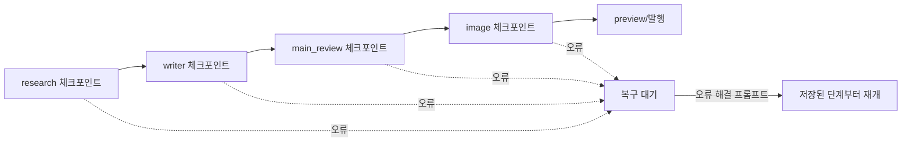

# 실제 실행 FLOW

## 일반 작업

1. 화면에서 계정, 카테고리, 키워드, 발행 목적, 검색 제공자, 원본 파일, 이미지 설정을 입력합니다.
2. `src/renderer/app.js`가 입력값을 모아 `job:start` IPC를 호출합니다.
3. `src/main.js`의 `startJob(form)`이 계정과 설정을 정규화하고 작업 디렉터리·입력·체크포인트를 준비합니다.
4. `resolveTopicInput()`이 수동 주제 또는 파일/검색 입력을 결정합니다.
5. 파일 모드면 `parseFiles()`가 자료를 구조화합니다. 검색 모드면 `collectSearchResults()`가 후보를 수집합니다.
6. `runCodexGeneration()`이 Research/Title → Writer → Main 검수 → Image 순서로 에이전트를 실행합니다.
7. 결과는 Preview 이벤트로 renderer에 전달되고 `agent-result.json` 및 작업 이력에 저장됩니다.
8. `publishAfterGenerate`가 켜져 있고 검수가 통과된 경우에만 Naver 발행 흐름으로 넘어갑니다. 기본값은 `DRY_RUN`입니다.
9. Naver 발행은 전용 Chrome 프로필에서 수동 로그인 세션을 확인한 뒤 SmartEditor에 제목·본문·이미지·카테고리·태그를 입력합니다.
10. 발행 결과를 원래 `job_...` 이력에 반영하고, 필요한 경우 별도 성공 기록도 남깁니다.

## 에이전트 단계와 체크포인트

체크포인트는 `runtime/jobs/job_<id>/job-checkpoint.json`에 저장됩니다. 이미지 단계는 이미지별 progress 파일을 사용하도록 계약되어 있으나, 실제 Image Worker 실행 성공과 모든 부분 재개 조합은 별도의 라이브 검증이 필요합니다.

## 회원마당 일일 흐름

`dailyWorkflow.js`의 별도 흐름입니다.

1. `crawlDailyMemberBoard()`가 회원마당을 수집합니다.
2. `createDailyPlan()`이 수집 글을 9개 분류 슬롯에 배정합니다.
3. `crawlDailyNaverStyle()`은 선택적으로 기존 블로그 스타일 규칙을 저장합니다.
4. `generateDailyDrafts()`는 승인 전 초안을 만듭니다.
5. 사용자가 항목을 승인합니다.
6. `publishApprovedDaily()`가 승인된 항목만 네이버 발행합니다.
7. 회원마당 단건 등록은 `runRandomDailyResearch()` 및 `memberBoardPublisher.js` 경로의 별도 기능입니다.

현재 README와 코드상 회원마당 일일 흐름은 고정 9개 슬롯을 수집·분류하는 흐름이며, 9개 카테고리 각각을 독립적으로 웹 검색하는 기획과는 다릅니다. 이 차이는 기능 설명이나 배포 문서에서 반드시 구분해야 합니다.

## 주요 IPC 연결

| IPC | 담당 함수 | 역할 |
|---|---|---|
| `job:start` | `startJob` | 일반 생성 시작 |
| `job:resume` | `resumeJob` | 저장된 중단 단계부터 재개 |
| `history:load` | `readHistory` | 이력 목록 읽기 |
| `history:publishDrafts` | `publishHistoryDrafts` | 선택 이력 순차 발행 |
| `history:regenerateDraft` | `regenerateHistoryDraft` | 원본 기반 초안 재생성 |
| `daily:runRandomResearch` | `runRandomDailyResearch` | 일일 랜덤 단건 흐름 |
| `daily:publishApproved` | `publishApprovedDaily` | 승인 일일 항목 발행 |
| `scheduler:register` | 스케줄러 등록 | Windows 예약 작업 등록 |

