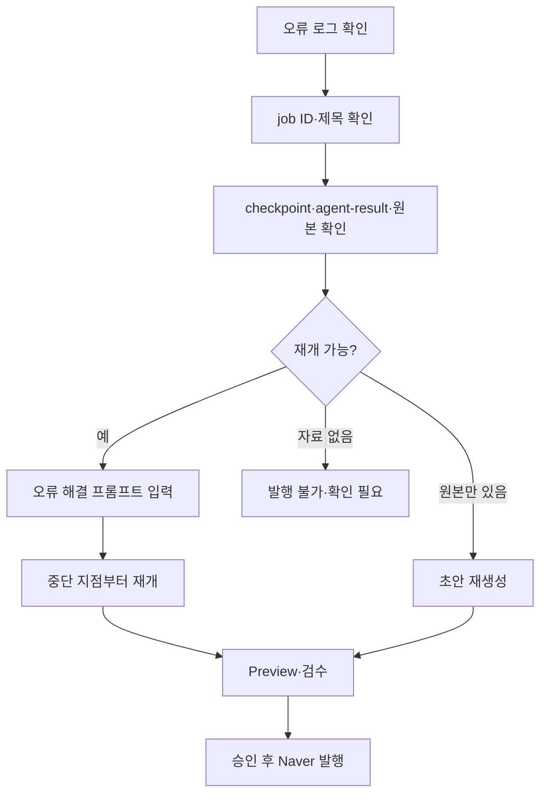

# 운영·설정·오류복구·AI HANDOFF

## 1. 주요 설정 파일

```text
%APPDATA%\blogauto-naver-tistory\runtime\user-settings.json
%APPDATA%\blogauto-naver-tistory\runtime\account-categories.json
%APPDATA%\blogauto-naver-tistory\runtime\blog_history.jsonl
%APPDATA%\blogauto-naver-tistory\runtime\member-board-daily-plan.json
%APPDATA%\blogauto-naver-tistory\runtime\scheduler-status.json
```

`user-settings.json`에는 Blog ID, 주제·키워드, source mode, 검색 제공자, 발행 공개·예약 설정, 이미지 설정, agent model이 저장됩니다. `account-categories.json`에는 계정별 카테고리, 키워드, 제외주제, 발행목적, 문체, 최신성, 검색 설정이 저장됩니다.

네이버 비밀번호는 저장하지 않습니다. 브라우저 세션은 runtime의 `browser-profiles/`에 저장되므로 GitHub와 문서에 포함하지 않습니다.

## 2. 작업 이력 운영

| 상태 | 의미 | 일반 조치 |
|---|---|---|
| `DRY_RUN` | 생성만 완료, 발행 안 함 | 검토 후 선택 글 자동 발행 |
| `generated`/`PREVIEW_READY` | 초안 준비 | 본문 확인 |
| `failed`/`session_expired` | 오류·로그인 만료 | 원인 분석·재발행 |
| `REVISION` | 수정 후 재검수 필요 | 초안 수정·재개 |
| `BLOCK` | 근거 부족 또는 발행 금지 | 원문·공식 출처 보강 |
| `success`/`PUBLISHED` | 발행 완료 또는 성공 처리 | 재발행하지 않음 |

작업 이력의 `새로고침`은 저장된 목록을 다시 읽는 기능이며, 에이전트 실행이나 발행을 시작하지 않습니다. 같은 제목은 최신 기록만 유지되고, 화면에는 현재 필터 기준 최대 20건이 표시됩니다.

## 3. 오류 복구 절차



오류 해결 프롬프트는 단계 재개에 사용할 보정 지시입니다. 체크포인트보다 앞 단계의 결과를 다시 만들 필요가 없는 경우에는 저장된 결과를 재사용해야 합니다. 단, 원본이나 `agent-result.json`이 없으면 기존 초안을 복원할 수 없습니다.

## 4. 유지보수 위치

| 기능 | 파일 |
|---|---|
| 검색·근거 | `src/lib/search.js` |
| 파일 파싱 | `src/lib/fileParser.js` |
| 프롬프트·에이전트·timeout | `src/lib/codexRunner.js` |
| Preview·버튼·이력 UI | `src/renderer/app.js`, `index.html`, `styles.css` |
| Naver selector·발행 확인 | `src/lib/naverPublisher.js` |
| 이력·중복·성공·삭제 | `src/lib/history.js` |
| 복구 해결책 | `src/lib/recoveryPlaybook.js`, `src/main.js` |
| 회원마당·9개 슬롯 | `dailyWorkflow.js`, `memberBoardCrawler.js` |
| Windows 예약 | `windowsScheduler.js`, `register-scheduler.ps1` |

## 5. 수정 시 회귀 방지

1. 실행 중인 프로그램·Chrome·사용자 runtime을 종료하지 않습니다.
2. 일반 작업과 회원마당 일일 작업을 분리해 확인합니다.
3. 작업 ID와 제목을 함께 검증해 선택 큐가 다른 글을 쓰지 않게 합니다.
4. 네이버 카테고리를 찾지 못하면 잘못된 발행을 하지 않습니다.
5. 발행 오류 시 브라우저를 유지합니다.
6. `npm run check`와 `npm run check:file-parser`를 실행합니다.
7. 실제 로그인·발행 성공은 소스 검사와 별도로 확인합니다.

## 6. AI에게 작업을 넘길 때

새 AI 세션은 먼저 이 문서와 [[01_프로그램_전체_역분석_FLOW]], [[02_설치_빌드_GitHub_배포]]를 읽어야 합니다.

AI는 다음을 지켜야 합니다.

- 정확한 프로젝트 경로와 Git 원격을 먼저 확인
- 비밀번호·토큰·Cookie를 출력하지 않음
- 기존 runtime과 실행 중 작업을 보존
- 확인된 사실과 추정을 구분
- `PASS`, `REVISION`, `BLOCK`, `PARTIAL`을 혼동하지 않음
- 배포·push·실제 발행 성공을 자동으로 선언하지 않음

## 7. 알려진 제한과 TODO

- portable과 과거 Setup 산출물의 공식 배포 기준 통합 필요
- 새 PC 설치·로그인·실제 Naver 발행 라이브 검증 필요
- Image Worker 이미지별 재개 라이브 검증 필요
- SmartEditor DOM selector 회귀 테스트 강화 필요
- 회원마당 수집형과 9개 카테고리 웹 검색형 일일 자동화를 명확히 분리할 필요
