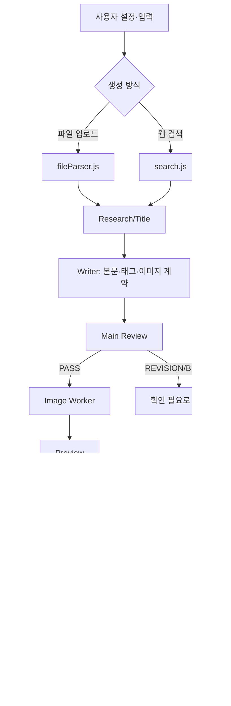
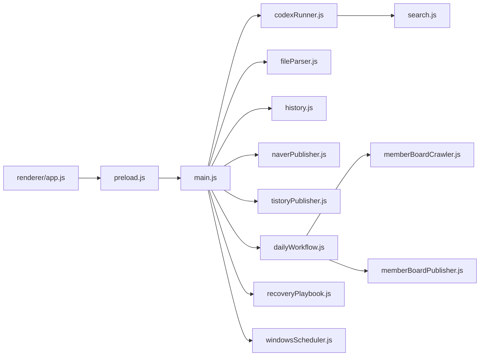
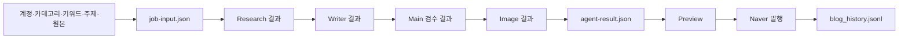
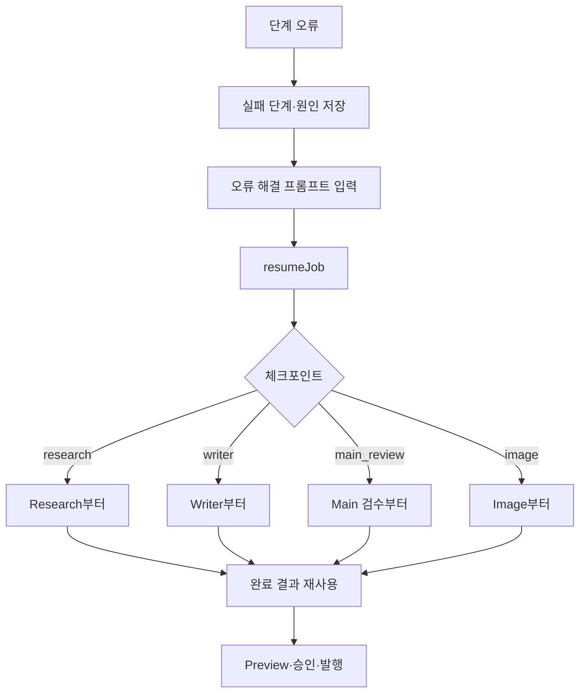

# 네이버 블로그 자동화 프로그램 — SKILL 역분석 MASTER

> [!IMPORTANT]
> 이 문서는 현재 프로젝트의 실제 소스·README·설정 구조를 기준으로 작성한 교육자료입니다. 구현 여부가 확인되지 않은 내용은 추측하지 않고 `확인 필요`로 표시합니다.

## 목차

- [[00_프로젝트_한장요약]]
- [[01_프로그램_전체구조]]
- [[02_실행_FLOW]]
- [[03_설치_및_실행방법]]
- [[04_설정값_환경변수]]
- [[05_오류_및_해결이력]]
- [[06_유지보수_가이드]]
- [[07_버전_변경이력_CHANGELOG]]
- [[08_백업_복구_GitHub]]
- [[09_향후개발_TODO]]
- [[10_AI_HANDOFF]]

## 1. 전체 업무 FLOW



## 2. 모듈 관계



## 3. 입력 → 출력 데이터 흐름



## 4. 단계별 실제 담당 함수

| 단계 | 실제 파일 | 핵심 함수 | 주요 출력 |
|---|---|---|---|
| 설정 정규화 | `src/lib/settings.js` | `readSettings`, `writeSettings` | `user-settings.json` |
| 계정 정규화 | `src/lib/accountStore.js` | `readAccountStore`, `writeAccountStore` | `account-categories.json` |
| 파일 파싱 | `src/lib/fileParser.js` | `parseUploadedFile`, `parseFiles` | 공통 문서·충돌 정보 |
| 웹 검색 | `src/lib/search.js` | `collectSearchResults`, `summarizeSourceQuality` | 검색 후보·근거 품질 |
| 에이전트 | `src/lib/codexRunner.js` | `runCodexTask`, `runCodexGeneration` | Research/Writer/Main/Image 결과 |
| 네이버 발행 | `src/lib/naverPublisher.js` | `publishToNaver` | SmartEditor 입력·발행 결과 |
| 이력 | `src/lib/history.js` | `readHistory`, `appendHistory` | `blog_history.jsonl` |
| 복구 | `src/main.js`, `recoveryPlaybook.js` | `resumeJob`, `recordRecoveryLesson` | 체크포인트·복구 지시 |

## 5. Preview → 승인 → 발행

기본 생성 결과는 `DRY_RUN`입니다. Main 검수가 `PASS`이고 발행 설정이 활성화된 경우에만 네이버 발행 단계로 진행합니다. 네이버 로그인과 보안 확인은 자동 입력하지 않고 사용자가 Chrome에서 직접 완료합니다.

카테고리는 실제 블로그 카테고리와 일치해야 하며, 찾지 못하면 잘못된 카테고리 발행을 방지하기 위해 중단합니다. 태그는 화면 변형에 따라 입력 영역이 없을 수 있는 선택 메타데이터입니다.

## 6. 오류 → 복구



작업별 복구 파일은 `runtime/jobs/job_<id>/job-checkpoint.json`이며, 최종 초안은 `agent-result.json`입니다. 원본 또는 초안 파일이 없으면 기존 이력을 바로 재발행할 수 없습니다.

## 7. 회원마당 일일 기능과 일반 기능의 경계

회원마당 일일 기능은 `memberBoardCrawler.js`로 게시글을 수집하고 `dailyWorkflow.js`에서 9개 슬롯으로 분류한 뒤 초안·승인·발행을 진행합니다. 현재 구현은 9개 카테고리 각각을 독립적으로 웹 검색하는 기획과 다릅니다. 그 웹 검색형 일일 자동화가 구현되어 있는지는 별도 확인 필요입니다.

## 8. 작업 이력

`history.js`는 이력을 시간순으로 정렬하고 같은 제목의 오래된 기록을 제거합니다. renderer는 현재 필터 기준 최대 20건을 표시합니다. `job_...` ID가 있는 원본 작업만 선택·발행 대상으로 사용할 수 있습니다.

일괄 발행은 작업 ID와 기대 제목을 함께 고정해 다른 글을 발행하지 않도록 확인합니다. 일반 일괄 발행은 오류 시 일시 중지하고, 선택 원인 분석·재발행은 항목별 오류를 남긴 뒤 다음 항목을 계속 처리하도록 분리되어 있습니다.

## 9. 최종 확인 상태

```text
ANALYSIS = PASS
FLOW_VERIFICATION = PASS (소스·README 대조)
FILE_VERIFICATION = PASS (주요 파일 대조)
INSTALL_VERIFICATION = PARTIAL (portable 빌드 확인, 새 PC 라이브 설치 미검증)
SECURITY_CHECK = PASS (문서에 실제 비밀값 미기록)
FINAL_STATUS = PARTIAL
```

`PARTIAL`은 문서화 실패가 아니라, 새 PC의 설치·로그인·실제 네이버 발행과 GitHub Release의 라이브 검증을 아직 수행하지 않았다는 의미입니다.
