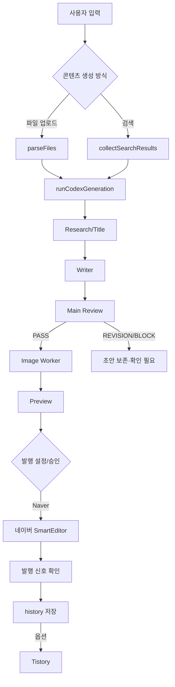
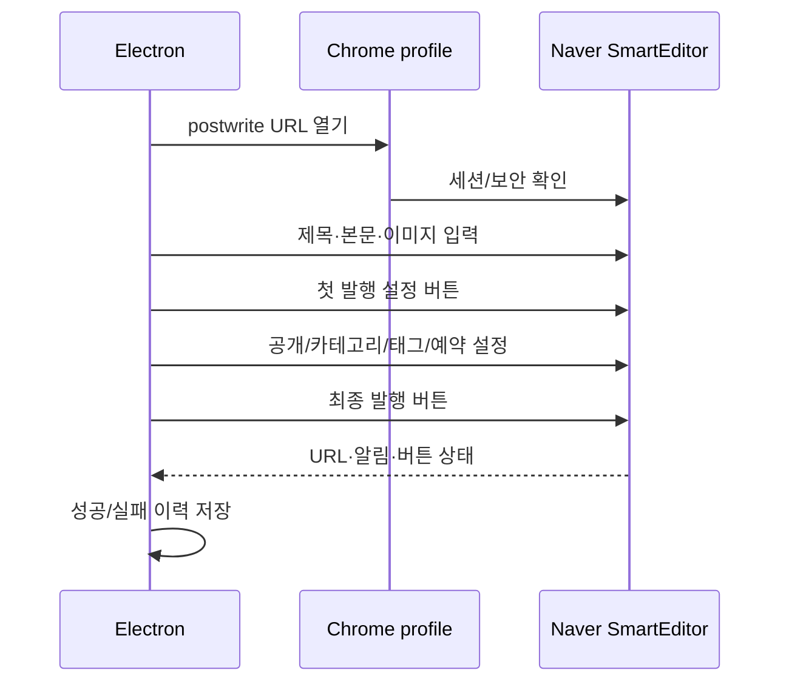
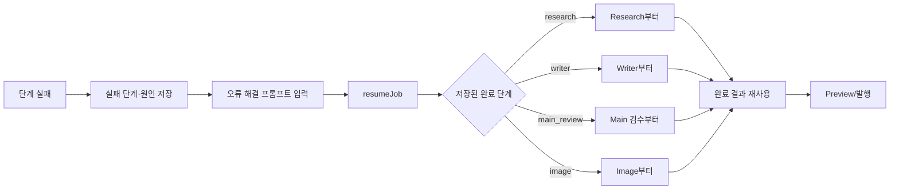

# 네이버 블로그 자동화 프로그램 SKILL 역분석 MASTER

## 목차

- [[README_INDEX]]
- [[00_프로젝트_한장요약]]
- [[01_프로그램_전체구조]]
- [[02_실행_FLOW]]
- [[03_설치_및_실행방법]]
- [[04_설정값_환경변수]]
- [[05_오류_및_해결이력]]
- [[06_유지보수_가이드]]
- [[07_버전_변경이력_CHANGELOG]]
- [[08_백업_복구_GitHub]]
- [[09_향후개발_TODO]]
- [[10_AI_HANDOFF]]

## 1. 분석 범위와 원칙

이 문서는 현재 `blogauto-naver` 소스, `README.md`, `package.json`, 검사 스크립트를 기준으로 작성한 교육·인수인계 자료입니다. 존재하지 않는 기능은 구현된 것으로 설명하지 않습니다. 로그나 UI만으로 확정할 수 없는 부분은 확인 필요로 남깁니다.

## 2. 전체 업무 FLOW



## 3. main process와 renderer

`src/main.js`는 Electron main process입니다. `startJob`, `resumeJob`, `publishHistoryDraft`, `publishHistoryDrafts`, `generateDailyDrafts`, `runRandomDailyResearch`, `publishApprovedDaily` 등이 실질적인 오케스트레이션을 담당합니다.

`src/preload.js`는 `window.blogAuto` API를 노출합니다. 예를 들면 다음 IPC가 있습니다.

```text
job:start / job:resume
history:load / history:loadDraft / history:publishDrafts
history:regenerateDraft / history:markSuccess / history:updateCategory
daily:crawlMemberBoard / daily:preparePlan / daily:generateDrafts
daily:runRandomResearch / daily:publishApproved
scheduler:register / scheduler:runMissedToday
```

renderer는 이 API로 화면 상태를 바꾸며, 에이전트의 로그·상태·Preview·완료 이벤트를 받습니다.

## 4. 입력 방식 분기

### 파일 업로드

`fileParser.js`는 다음 형식을 지원합니다.

```text
.txt .md .pdf .docx .xlsx .xls .csv .pptx
```

PDF는 `pdfjs-dist`, DOCX는 `mammoth`, 표 형식은 `xlsx`를 사용합니다. PDF에서 읽을 텍스트가 없으면 스캔·이미지형 PDF일 가능성으로 `PDF_TEXT_EMPTY` 오류를 냅니다. 파일 모드의 자료는 Writer와 Research의 근거로 전달되며 현재 README는 이 모드에서 웹 검색을 실행하지 않는다고 설명합니다.

### 검색

`search.js`는 Naver/Google 후보를 수집하고, 링크·본문·도메인·최신성·공식성·독립 편집 매체 여부를 점수화합니다. 정책·법률·모집·가격·일정처럼 행동에 영향을 주는 주제는 공식·기관 근거를 우선합니다.

## 5. 에이전트 처리

`codexRunner.js`의 `runCodexTask()`가 Codex 실행 프로세스를 시작하고, 기본 작업 제한은 코드상 10분입니다. `runCodexGeneration()`은 Research/Title, Writer, Main Review, Image Worker 결과를 정규화합니다.

작업별 산출물은 `runtime/jobs/job_<id>/`에 저장됩니다.

```text
job-input.json          # 민감정보를 제거한 입력
job-checkpoint.json     # 마지막 완료 단계와 복구 상태
agent-result.json       # 제목·본문·태그·이미지 결과
image-worker-progress-* # 이미지별 진행 결과
```

## 6. Preview와 발행

Preview는 renderer가 제목, 본문, 원본, 태그, 이미지 자산을 표시하는 단계입니다. 검수 결과가 `PASS`이고 발행 설정이 켜진 경우에만 네이버 발행으로 진행합니다. 기본 생성 상태는 `DRY_RUN`입니다.

`naverPublisher.js`는 전용 persistent Chrome context를 사용합니다. 로그인은 자동 입력하지 않고 수동으로 완료한 세션을 재사용합니다. 발행은 다음 구조입니다.



태그 입력칸은 화면 변형에 따라 없을 수 있는 선택 메타데이터입니다. 반면 카테고리는 잘못된 카테고리로 발행하지 않도록 찾지 못하면 중단합니다.

## 7. 작업 이력

`history.js`는 `blog_history.jsonl`을 읽고 씁니다. 읽을 때 timestamp 내림차순으로 정렬하고 같은 제목의 오래된 기록을 제거합니다. 따라서 작업 이력의 최근 20건 화면은 저장된 모든 시도를 그대로 보여주는 것이 아니라, 중복 제거 후 renderer가 현재 필터 기준 최대 20건을 보여주는 구조입니다.

작업 이력의 선택 가능한 항목은 `job_...` ID가 있는 원본 작업입니다. 성공 발행에 따른 synthetic `history-publish-...` 기록은 선택 대상이 아닙니다.

일괄 발행은 `{jobId,title}` 큐를 고정하고, 실제 초안 제목과 기대 제목이 다르면 중단하여 다른 글을 발행하지 않도록 합니다. 일반 일괄 발행은 한 항목에서 오류가 나면 일시 중지하며, 원인 분석·재발행 일괄 처리는 항목별 오류를 기록하고 다음 항목으로 진행하도록 분리되어 있습니다.

## 8. 복구 FLOW



복구 프롬프트가 표시됐다는 사실과 실제로 이전 단계가 재실행되지 않았다는 사실은 구분해야 합니다. 로그에 저장된 research 단계부터 작업한다는 문구가 다시 나타나면, 체크포인트가 새 실행파일에 의해 올바르게 해석됐는지와 실제 runtime 경로를 확인해야 합니다.

## 9. 회원마당 일일 기능

`memberBoardCrawler.js`가 회원마당 게시글을 수집하고 `dailyWorkflow.js`가 9개 고정 슬롯으로 계획을 만듭니다. `member-board-daily-plan.json`에 계획·초안·승인 상태를 저장합니다.

현재 구현과 사용자가 제안한 웹 검색형 기획은 다릅니다.

| 현재 구현 | 별도 기획 |
|---|---|
| 회원마당 게시판 수집 | 9개 카테고리별 독립 웹 검색 |
| 게시글을 9개 슬롯에 분류 | 카테고리 키워드·출처로 최신 주제 선정 |
| 회원마당 원문 중심 초안 | 웹 공식·독립 출처 수집 후 초안 |
| 승인된 항목 네이버 발행 | 검색 결과 기반 검수 후 발행 |

이 둘을 같은 기능이라고 문서화하면 사용자가 실제 동작을 잘못 이해할 수 있습니다.

## 10. Windows 스케줄러

`windowsScheduler.js`와 PowerShell 보조 스크립트는 09:00, 10:30, 12:00 작업을 등록·해제하고 상태를 저장합니다. README의 현재 설명은 다음과 같습니다.

- 09:00: 회원마당 수집과 초안
- 10:30: 수집 실패·초안 재시도
- 10:45~11:45: 사용자 승인 대기
- 12:00: 승인 항목 발행

컴퓨터가 꺼져 있거나 Windows 대화형 세션·Chrome 세션이 없으면 실제 자동화는 제한될 수 있습니다.

## 11. 데이터 보안

`.gitignore`는 runtime, browser profiles, 계정 설정, 로그, 빌드 산출물, 환경 파일을 제외합니다. 계정 정규화와 설정 정규화는 구형 네이버 비밀번호 필드를 제거합니다. 문서에는 실제 계정·비밀번호·쿠키·토큰을 기록하지 않습니다.

## 12. 문제 발생 시 조사 순서

1. 로그의 마지막 단계와 상태를 확인합니다.
2. job ID와 제목을 확인합니다.
3. `job-checkpoint.json`, `agent-result.json`, 입력 원본 존재 여부를 확인합니다.
4. 카테고리·로그인·브라우저 프로필·SmartEditor DOM을 각각 분리해 확인합니다.
5. 수정 시 source runtime과 사용자 runtime을 혼동하지 않습니다.
6. `npm run check`와 파일 파서 검사를 실행합니다.
7. 라이브 발행은 사용자 승인 후 한 건으로 검증합니다.

## 13. 최종 검증 보고

```text
ANALYSIS = PASS
FLOW_VERIFICATION = PASS (소스·README 기준)
FILE_VERIFICATION = PASS (주요 파일 존재 확인)
INSTALL_VERIFICATION = PARTIAL (portable 빌드 경로 확인, 새 PC 라이브 설치 미검증)
SECURITY_CHECK = PASS (문서에 비밀값 미기록, 공개 전 추가 스캔 필요)
OBSIDIAN_MD = CREATED (프로젝트 docs 폴더)
FINAL_STATUS = PARTIAL
```

`FINAL_STATUS = PARTIAL`인 이유는 문서 역분석은 완료했지만, GitHub 공개/Release와 새 PC 설치·로그인·실제 네이버 발행 라이브 검증은 아직 수행하지 않았기 때문입니다.
